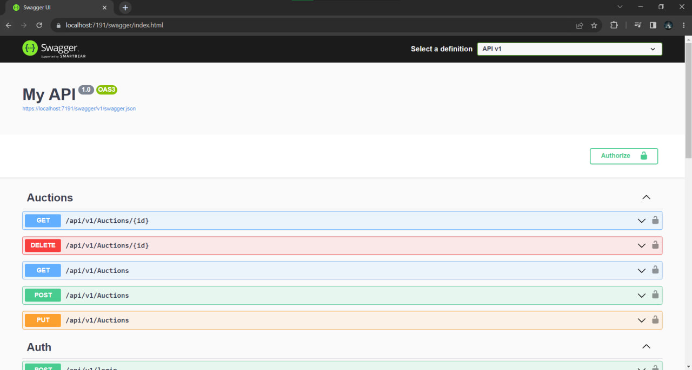
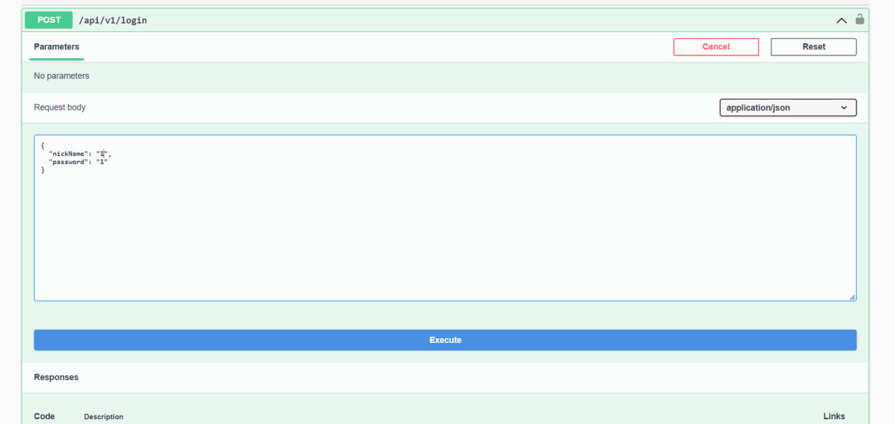
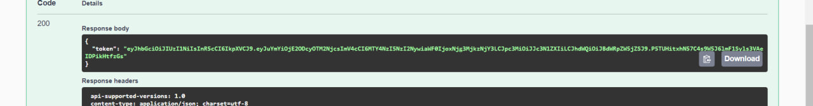
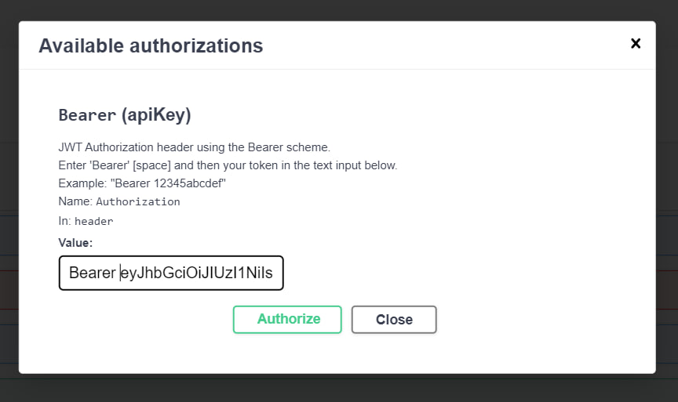
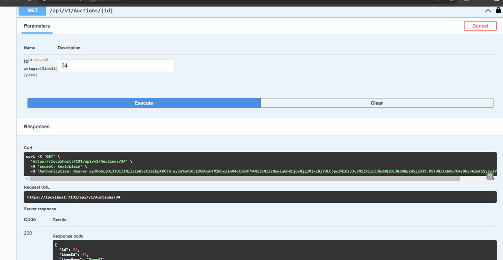
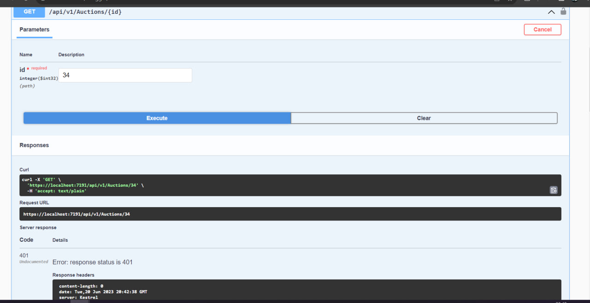
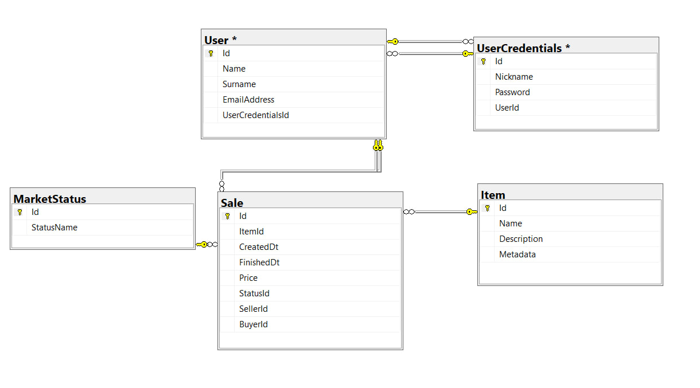

# How to test Item-Marketplace
## 1.Fisrt of all you must run WebApi project.
## 2.Then you need to add to out link "/swagger/index.html".

## 3.Then you need to authorize by entering the nickname and password to api/login method.

## 4.Now you have JWT token.

## 5.You need click on green icon with lock. Then you need to past your token in such format: "Bearer 'your token'". 

## 6.Congratulation! Youve authorized! Now you can test your methods.

## 7.If you don't authorize, you'll get a 401 error.

## 8.Before runing the program, you need to ensure, that your database has such sheme:

